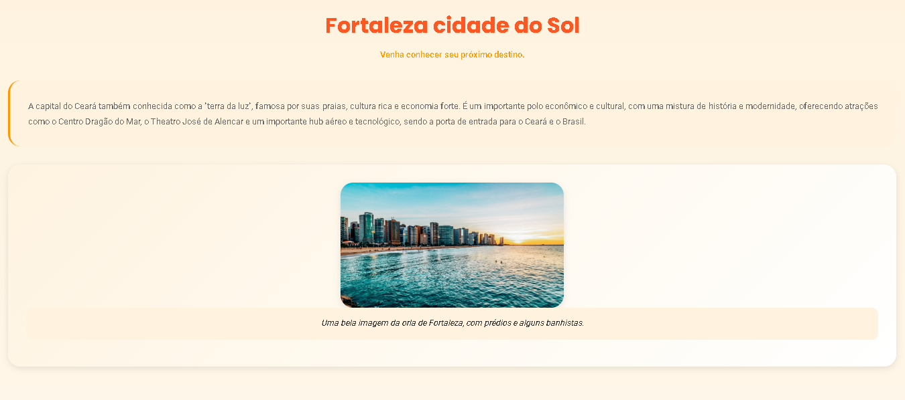

<div align="center">

# 💼 Portfólio - Erick de Almeida


**Desenvolvedor Full Stack em Formação | Corinthians ⚽**

[](https://seuusuario.github.io/portfolio/)
[](https://linkedin.com/in/seuperfil)
[](mailto:erickalcosta@gmail.com)


</div>

## 👋 Sobre Mim

Olá! Sou **Erick de Almeida**, um desenvolvedor em constante evolução apaixonado por tecnologia e programação. Atualmente focado em me tornar um **Desenvolvedor Full Stack**, com conhecimentos em front-end (HTML, CSS) e back-end (Java).

**🎯 Objetivo:** Me tornar um desenvolvedor completo, dominando tanto tecnologias front-end quanto back-end para criar soluções completas e eficientes.

## 🚀 Habilidades

### 💻 **Tecnologias**
- **Front-end:** HTML5, CSS3 (Bootstrap Icons)
- **Back-end:** Java
- **Ferramentas:** Git, GitHub
- **Design:** UI/UX Básico, Design Responsivo

### 🧠 **Em Aprendizado**
- JavaScript
- React.js / Vue.js
- Node.js
- Banco de Dados (SQL/NoSQL)

## 📂 Projetos Destacados

### 1. 🏞️ Site de Turismo Local
**Tecnologias:** HTML, CSS  
**Descrição:** Site responsivo para promover pontos turísticos locais, com design moderno e focado na experiência do usuário.  
**Preview:**  


### 2. 📊 Sistema de Média Escolar
**Tecnologias:** Java  
**Descrição:** Aplicação console para cálculo de média escolar, demonstrando lógica de programação e manipulação de dados.  
**Características:**
- Cálculo de médias ponderadas
- Validação de notas
- Classificação por conceito (A-F)

### 3. 🏦 Simulador de Conta Corrente
**Tecnologias:** Java  
**Descrição:** Sistema que simula operações bancárias básicas, demonstrando conceitos de POO e manipulação de estados.  
**Funcionalidades:**
- Depósito e saque
- Consulta de saldo
- Histórico de transações

## 🎓 Formação e Desenvolvimento

### 🎯 **Metodologia de Aprendizado**
- **Prática Constante:** Desenvolvimento de projetos reais
- **Base Sólida:** Foco em fundamentos de programação
- **Versatilidade:** Estudo tanto front-end quanto back-end
- **Comunidade:** Participação ativa em fóruns e grupos de desenvolvimento

### 📚 **Cursos e Certificações**
- Desenvolvimento Web (HTML/CSS/JavaScript) - **Em andamento**
- Java Fundamentos - **Completo**
- Git e GitHub - **Completo**

## 🎨 Design do Portfólio

### ✨ **Características do Design**
- **Responsivo:** Adapta-se a qualquer dispositivo
- **Minimalista:** Foco no conteúdo
- **Acessível:** Boa contrastação e navegação
- **Pessoal:** Toque único com identidade visual

### 🎯 **Seções Implementadas**
1. **Apresentação Pessoal** - Quem sou e objetivos
2. **Habilidades** - Tecnologias dominadas
3. **Projetos** - Trabalhos realizados
4. **Contato** - Formas de conexão

## 🔧 Tecnologias Utilizadas no Portfólio

| Tecnologia | Finalidade | Status |
|------------|------------|---------|
| **HTML5** | Estrutura semântica | ✅ Implementado |
| **CSS3** | Estilização e layout | ✅ Implementado |
| **Bootstrap Icons** | Ícones e elementos visuais | ✅ Implementado |
| **GitHub Pages** | Hospedagem gratuita | ✅ Implementado |

## 📱 Responsividade

O portfólio foi desenvolvido com **mobile-first approach**, garantindo:

- ✅ **Desktop (> 1024px)**: Layout otimizado para telas grandes
- ✅ **Tablet (768px-1024px)**: Ajuste proporcional de elementos
- ✅ **Mobile (< 768px)**: Navegação simplificada, toque amigável

## 🚀 Como Executar Localmente

```bash
# 1. Clone o repositório
git clone https://github.com/seuusuario/portfolio.git

# 2. Acesse a pasta do projeto
cd portfolio

# 3. Abra no navegador (métodos alternativos)
# Opção A: Clique duplo no index.html
# Opção B: Servidor local (recomendado):
python -m http.server 8000
# Acesse: http://localhost:8000